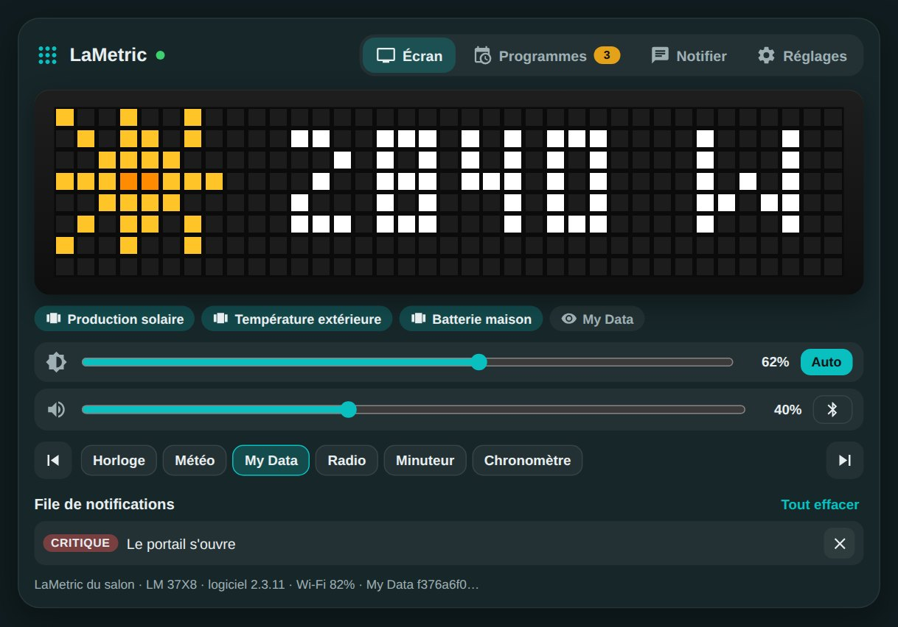
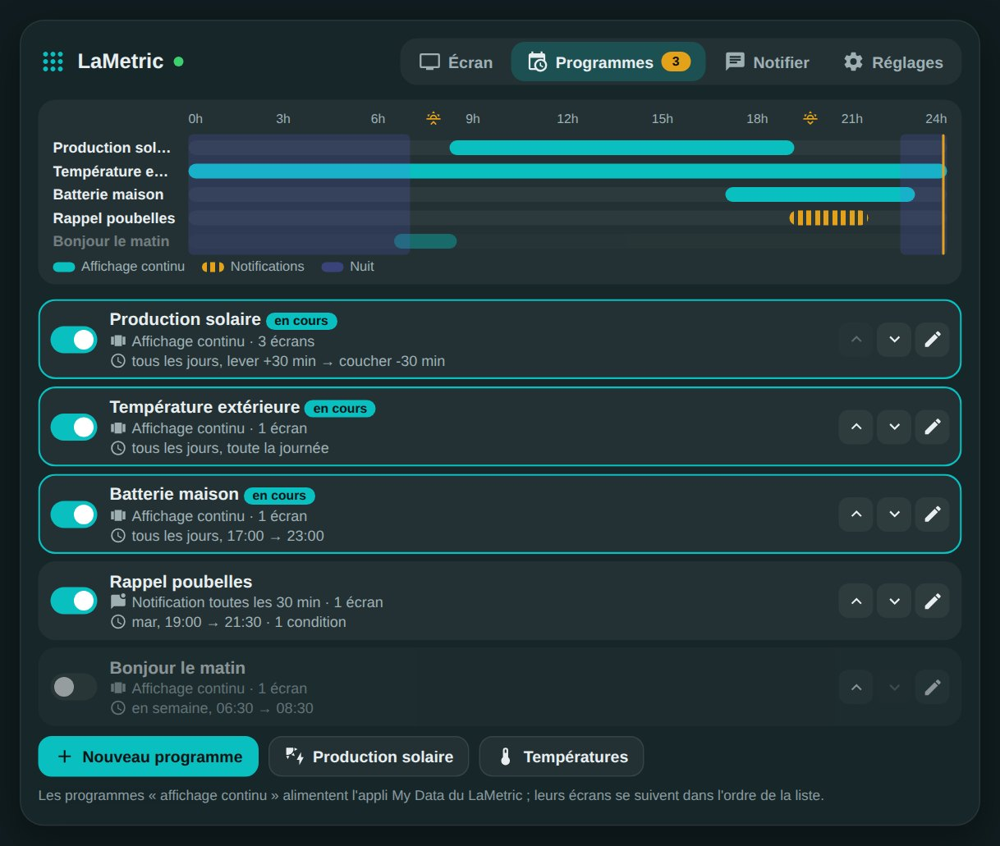
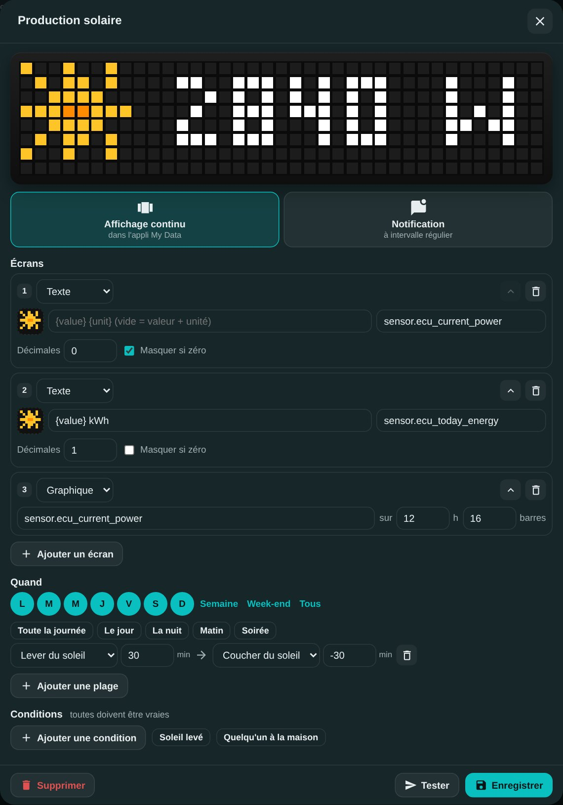
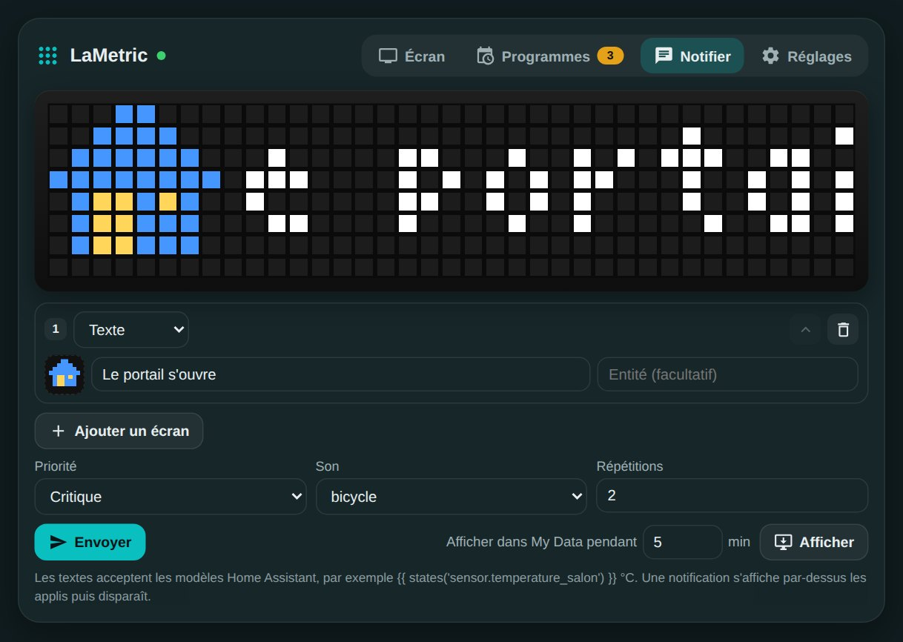

# 🟨 HOLM LaMetric

[](https://hacs.xyz/)


**Tout le LaMetric Time dans Home Assistant, et des programmes pour décider quoi afficher, quand.**

HOLM LaMetric remplace l'intégration LaMetric officielle. Elle pilote l'horloge par son **API locale** : luminosité, volume, applis, réveil, minuteur, radio, notifications riches. Elle ajoute surtout des **programmes** : la production solaire défile toute la journée mais plus le soir, la température extérieure reste affichée, la batterie de la maison apparaît en fin de journée, un rappel arrive le mardi soir… le tout réglé depuis une carte, sans YAML.

> ✨ **La carte est fournie par l'intégration** : aucune ressource Lovelace à ajouter. Les réglages de l'intégration officielle sont repris en un clic.



| Les programmes | Un programme |
|---|---|
|  |  |

### En bref

- 🗓️ **Programmes** :
  - **affichage continu** : les écrans des programmes actifs défilent dans l'appli **My Data** du LaMetric, mis à jour dès qu'une valeur change ;
  - **notification** : envoyée toutes les X minutes, ou une fois au début de chaque plage ;
  - actifs selon les **jours**, des **plages horaires** (heure fixe, lever ou coucher du soleil avec décalage, plages qui passent minuit) et des **conditions** sur vos entités ;
  - une **frise sur 24 h** montre qui s'affiche quand.
- 🖼️ **Écrans** : texte (avec les modèles Home Assistant ou la valeur d'une entité), **jauge** (une batterie, un objectif), **graphique** de l'historique d'une entité. Option « masquer si zéro » pour la production solaire la nuit.
- 🔎 **Les ~74 000 icônes LaMetric** se cherchent par nom directement dans la carte.
- 🌙 **Mode nuit** : seules les notifications importantes passent, sans son, et la luminosité baisse puis revient le matin.
- 🔔 **Notifications riches** : plusieurs écrans, priorité, son (ou MP3), répétitions, durée de vie. Le mode nuit s'applique aussi à vos automatisations, si vous le souhaitez.
- 🎛️ **Tout l'appareil** : luminosité et mode auto, volume, Bluetooth, économiseur d'écran, appli affichée, appli suivante ou précédente, réveil, minuteur, chronomètre, radio, cadran de l'horloge.
- 👀 **La carte** montre en direct ce qu'affiche le LaMetric, sur un écran LED fidèle (37 × 8), avec les réglages rapides et la file de notifications.

---

## Sommaire

- [Installation](#installation)
- [Configuration](#configuration)
- [La carte `holm-lametric-card`](#la-carte-holm-lametric-card)
- [Programmes](#programmes)
- [Mode nuit](#mode-nuit)
- [Actions](#actions)
- [Venir de l'intégration officielle](#venir-de-lintégration-officielle)
- [Entités](#entités)
- [FAQ / dépannage](#faq--dépannage)

---

## Installation

### Via HACS (recommandé)

1. HACS → menu ⋮ → **Dépôts personnalisés** → ajoutez `https://github.com/kaaribou/lametric-holm`, catégorie **Intégration**.
2. Recherchez **HOLM LaMetric** et installez.
3. Redémarrez Home Assistant.

### Manuelle

Copiez le dossier `custom_components/lametric_holm` dans le dossier `custom_components` de votre configuration, puis redémarrez Home Assistant.

---

## Configuration

### 1. Préparer le LaMetric

Pour l'affichage continu, installez l'appli **My Data DIY** sur le LaMetric (depuis l'application mobile LaMetric, rubrique « Apps »), puis réglez-la ainsi :

- **Type** : `HTTP Push` ;
- **Data Format** : `Predefined (LaMetric Format)`.

L'intégration la trouve toute seule. Sans elle, tout fonctionne sauf l'affichage continu des programmes.

### 2. Ajouter l'intégration

**Paramètres → Appareils et services → Ajouter une intégration → HOLM LaMetric.**

- Si l'intégration **LaMetric officielle** est déjà configurée, choisissez « Reprendre ses réglages » : l'adresse et la clé d'API sont reprises, rien à saisir.
- Sinon, saisissez l'**adresse IP** du LaMetric et sa **clé d'API** (sur [developer.lametric.com](https://developer.lametric.com), rubrique *Devices*).

Les deux intégrations peuvent fonctionner en même temps le temps de migrer vos automatisations.

### Options

| Option | Rôle | Par défaut |
|---|---|---|
| Fréquence de lecture | Intervalle de lecture de l'état du LaMetric | 30 s |
| Appli My Data | Widget My Data utilisé pour l'affichage continu, si vous en avez plusieurs | Automatique |

---

## La carte `holm-lametric-card`

```yaml
type: custom:holm-lametric-card
```

| Option | Valeurs | Par défaut |
|---|---|---|
| `title` | texte | `LaMetric` |
| `view` | `full` (onglets) · `screen` (écran et réglages rapides seulement) | `full` |
| `tab` | onglet à l'ouverture : `screen` · `programmes` · `notify` · `settings` | `screen` |
| `show_frame` | `false` pour une carte sans cadre | `true` |
| `entry_id` | pour viser un LaMetric précis si vous en avez plusieurs | le premier |

Quatre onglets :

- **Écran** : ce qu'affiche My Data en ce moment, les programmes en cours, luminosité, volume, Bluetooth, les applis (un clic pour en changer) et la file des notifications.
- **Programmes** : la frise de la journée, la liste des programmes (activer, réordonner, modifier) et deux modèles prêts à l'emploi, **Production solaire** et **Températures**, qui trouvent seuls vos capteurs.
- **Notifier** : composez une notification et envoyez-la, ou affichez-la quelques minutes dans My Data.
- **Réglages** : pause générale des programmes, écran d'attente, mode nuit, son par défaut, mode de défilement des applis, économiseur d'écran.



---

## Programmes

Un programme, c'est **quoi afficher** (des écrans) et **quand** (jours, plages, conditions).

### Deux façons d'afficher

| Mode | Ce qui se passe |
|---|---|
| **Affichage continu** | Tant que le programme est actif, ses écrans sont envoyés à l'appli My Data. Les écrans de tous les programmes actifs se suivent dans l'ordre de la liste. Quand aucun n'est actif, l'**écran d'attente** prend le relais. |
| **Notification** | Tant que le programme est actif, une notification est envoyée toutes les X minutes. Avec un intervalle à 0, elle part une seule fois au début de chaque plage. |

### Les écrans

| Type | Contenu |
|---|---|
| **Texte** | Un texte fixe, un modèle (`{{ states('sensor.x') }}`), ou la valeur d'une entité (son état ou l'un de ses attributs, par exemple la température d'une entité météo). Avec une entité, `{value}` et `{unit}` se placent où vous voulez (`Salon {value}°`) ; laissé vide, le texte affiche la valeur et son unité. Décimales réglables, option « masquer si zéro ». |
| **Jauge** | La valeur d'une entité entre un début et un objectif, avec une barre de progression. |
| **Graphique** | L'historique d'une entité sur les X dernières heures, en barres. |

Les entités se choisissent dans une fenêtre de recherche (nom, pièce ou identifiant, filtres par type). Une fois l'entité choisie, une liste propose d'utiliser son **état** ou l'un de ses **attributs** : pour une entité météo, la température, l'humidité, la pression ou le vent ; l'unité suit automatiquement.

Chaque écran peut avoir une icône LaMetric : cliquez sur la case de l'icône et cherchez par nom (en anglais : *sun*, *battery*, *car*…), ou saisissez directement son code (`i1234`, `a1234`).

### Quand

- **Jours** de la semaine.
- **Plages horaires** : début et fin à une heure fixe, ou au lever / coucher du soleil avec un décalage en minutes. Une plage peut passer minuit (22:30 → 07:00). Sans plage, le programme est actif toute la journée. Raccourcis : *Le jour*, *La nuit*, *Matin*, *Soirée*.
- **Conditions** sur des entités ou leurs attributs (=, ≠, >, <, ≥, ≤) : toutes doivent être vraies. Raccourcis : *Soleil levé*, *Quelqu'un à la maison*.

L'aperçu en haut de l'éditeur affiche les vraies valeurs, comme sur le LaMetric.

---

## Mode nuit

Dans l'onglet **Réglages**, ou avec `switch.holm_lametric_mode_nuit` :

- **plage** de nuit (heure fixe ou soleil) ;
- **notifications admises** : critiques seulement, ou importantes et critiques ;
- **silence** la nuit, sauf pour les critiques ;
- **luminosité la nuit** (facultatif) : appliquée au début de la nuit, l'ancienne valeur revient le matin ;
- **appliquer aux automatisations** : le filtre vaut aussi pour `lametric_holm.notify` et l'entité `notify` (sauf `ignore_night: true`).

---

## Actions

Le paramètre `device` est facultatif si vous n'avez qu'un LaMetric.

### `lametric_holm.notify`

```yaml
action: lametric_holm.notify
data:
  message: "Le portail s'ouvre"
  icon: i4516
  priority: critical        # info · warning · critical (réveille l'écran)
  sound: bicycle            # son LaMetric, ou adresse d'un MP3
  cycles: 2
```

Plusieurs écrans, avec jauge et graphique :

```yaml
action: lametric_holm.notify
data:
  frames:
    - text: "Production {{ states('sensor.ecu_current_power') }} W"
      icon: a72455
    - type: goal
      entity: sensor.batterie
      end: 100
      unit: "%"
    - type: chart
      entity: sensor.ecu_current_power
      hours: 12
```

Autres champs : `icon_type` (none, info, alert), `repeat` (répétitions du son), `lifetime` (secondes), `ignore_night`. L'action renvoie l'identifiant de la notification.

### Les autres actions

| Action | Rôle |
|---|---|
| `lametric_holm.dismiss` | Efface la notification affichée, une notification (`id`) ou toutes (`all: true`) |
| `lametric_holm.push_frames` | Affiche des écrans dans My Data pendant X minutes, à la place des programmes |
| `lametric_holm.programme` | Active, désactive ou affiche tout de suite un programme (par son nom) |
| `lametric_holm.activate_app` | Passe sur une appli (`app: Météo`) |
| `lametric_holm.alarm` | Règle le réveil (`time`, `enabled`, `wake_with_radio`) |
| `lametric_holm.timer` | Minuteur : `start` avec une `duration`, `pause`, `reset` |
| `lametric_holm.stopwatch` | Chronomètre : `start`, `pause`, `reset` |
| `lametric_holm.radio` | Radio : `play`, `stop`, `next`, `prev` |
| `lametric_holm.clockface` | Cadran de l'horloge : `weather`, `page_a_day`, `none`, ou une icône |
| `lametric_holm.app_action` | N'importe quelle action d'appli (paquet, action, paramètres) |

---

## Venir de l'intégration officielle

1. Ajoutez HOLM LaMetric en reprenant les réglages de l'intégration officielle.
2. Remplacez dans vos automatisations :

| Avant | Après |
|---|---|
| `notify.<lametric>` avec `data: {icon, sound, priority, cycles, icon_type}` | `lametric_holm.notify` avec `message`, `icon`, `sound`, `priority`, `cycles`, `icon_type` au même niveau |
| `lametric.message` (`device_id`, `message`, `icon`…) | `lametric_holm.notify` (sans `device_id`) |
| `lametric.chart` | `lametric_holm.notify` avec un écran `chartData` ou `type: chart` |

   Les icônes au format de l'intégration officielle (`4516`) sont acceptées telles quelles.
3. Supprimez l'intégration officielle. Si Home Assistant la repropose dans « Découvert », cliquez sur « Ignorer ».

---

## Entités

Les entités s'appellent `<domaine>.holm_lametric_…` :

| Entité | Rôle |
|---|---|
| `number` Luminosité, Volume | Réglages (régler la luminosité passe en mode manuel) |
| `select` Mode de luminosité, Défilement des applis, Appli affichée | |
| `switch` Bluetooth, Économiseur d'écran | |
| `switch` Programmes | Met tous les programmes en pause |
| `switch` Mode nuit | Attribut `in_night` : la nuit est-elle en cours |
| `button` Appli suivante / précédente, Effacer la notification, Effacer toutes les notifications | |
| `sensor` Appli en cours, Notifications en attente, Programmes actifs | Les programmes actifs listent leurs noms en attribut |
| `sensor` Signal Wi-Fi, Logiciel, Adresse IP | Diagnostic |
| `notify` Notification | Pour `notify.send_message` |

---

## FAQ / dépannage

**« Appli My Data DIY introuvable » dans la carte.**
Installez *My Data DIY* sur le LaMetric et réglez-la en `HTTP Push`. Elle est détectée à la lecture suivante (2 minutes au plus).

**Une notification « info » ne s'affiche pas.**
Quand l'économiseur d'écran est actif, le LaMetric n'affiche que les notifications **critiques**. Le mode nuit de HOLM LaMetric peut aussi les retenir.

**Les icônes de la recherche n'apparaissent pas tout de suite.**
La première recherche télécharge le catalogue LaMetric (~74 000 icônes), quelques secondes. Il est gardé une semaine dans Home Assistant.

**Les accents ou les emojis s'affichent mal sur le LaMetric.**
L'écran LaMetric ne connaît pas les emojis ; les accents dépendent du logiciel de l'horloge. L'aperçu de la carte montre les lettres sans accent.

---

## Un petit merci ?

HOLM LaMetric vous rend service ? Vous pouvez m'offrir une bière 🍺

[](https://paypal.me/kaaribou)

---

## Crédits & licence

- API locale et icônes : [LaMetric](https://lametric.com). Projet indépendant, sans lien avec LaMetric.
- Code : licence **MIT** — © kaaribou.

Voir le [CHANGELOG](CHANGELOG.md).

Fait partie de **HOLM — Home Orchestration & Living Management** : la gestion et l'orchestration intelligente de la maison.

Les autres projets : [Volets HOLM](https://github.com/kaaribou/volets-holm) · [Climat HOLM](https://github.com/kaaribou/climat-holm) · [Carburant HOLM](https://github.com/kaaribou/carburant-holm) · [Commandes à la maison HOLM](https://github.com/kaaribou/commandes-holm) · [HOLM My Menu](https://github.com/kaaribou/holm-mymenu) · [HOLM Navbar Card](https://github.com/kaaribou/holm-navbar-card) · [HOLM Climate Card](https://github.com/kaaribou/climate-card-holm) · [HOLM Music Card](https://github.com/kaaribou/holm-music-card) · [HOLM Sentinel Card](https://github.com/kaaribou/holm-sentinel-card) · [HOLM Security Card](https://github.com/kaaribou/holm-security-card) · [HOLM Recordings Card](https://github.com/kaaribou/holm-recordings-card) · [HOLM Covers Card](https://github.com/kaaribou/holm-covers-card) · [HOLM Power Flow Card](https://github.com/kaaribou/holm-power-flow-card) · [HOLM Energy Cards](https://github.com/kaaribou/holm-energy-cards) · [HOLM Radiator Card](https://github.com/kaaribou/holm-radiator-card) · [HOLM Floor Card](https://github.com/kaaribou/holm-floor-card) · [HOLM Smoke Card](https://github.com/kaaribou/holm-smoke-card) · [HOLM BG Card](https://github.com/kaaribou/holm-bg-card).
